# Especificação Técnica de Bootstrap e Persistência Local no Dispositivo (G5)

> **Documento Canônico**: Especificação arquitetural, de resiliência e segurança do bootstrap do cliente `Xandeflix Prebuilt`.
> **Gate**: G5 (`XANDEFLIX_PREBUILT_G5_FAST_DEVICE_BOOTSTRAP`).
> **Estratégia de Armazenamento**: `LOCAL_STORAGE_STRATEGY=CAPACITOR_FILESYSTEM_CANONICAL_JSON`.
> **Segurança de Armazenamento**: `APP_PRIVATE_STORAGE=SIM` (`Directory.Data`).

---

## 1. Objetivo

Implementar a camada cliente responsável por importar, verificar, persistir e ativar localmente pacotes de provisionamento PREBUILT (`.zip`), fornecendo um catálogo ativo, íntegro e imediatamente disponível para renderização da UI (G6), sem necessidade de parsing pesado ou conexões remotas no momento da inicialização.

---

## 2. Escopo

### Incluído no G5
- Entrada de pacotes de provisionamento pré-validados (`PackageImporter`);
- Verificação integral com fail-closed via `PackageValidator` (G4) antes de qualquer persistência;
- Materialização isolada em área de staging (`prebuilt/staging/<snapshotId>/`);
- Validação de releitura estrita (`STAGING_READBACK_VALIDATION`);
- Promoção atômica e manutenção de ponteiro ativo (`ActivePointer`);
- Proteção estrita contra falso vazio (`NO_FALSE_EMPTY_GUARD`);
- Idempotência de reimportação (`SAME_PACKAGE_REIMPORT=IDEMPOTENT`);
- Preservação do último estado bom em caso de atualização defeituosa (`FAILED_IMPORT_PRESERVES_ACTIVE=SIM`);
- Suporte a múltiplas gerações de snapshot;
- Abstração de persistência (`LocalCatalogStorage`) com implementações para Capacitor Filesystem e In-Memory;
- Read model mínimo (`getActiveCatalog()`, `getActiveMetadata()`).

### Explicitamente Excluído do G5
- Interface visual (UI) de catálogo, carrosséis, listagens ou navegação (escopo G6);
- Motor ou persistência de busca textual / índice FTS (escopo G7);
- Player, reprodução de mídia ou resolução de URLs de stream (escopo G8);
- Aquisição ou download remoto de pacotes via HTTP/CDN;
- Atualização delta/incremental de catálogo (escopo G9);
- Criptografia do pacote ou do catálogo no dispositivo;
- Assinatura digital do pacote;
- Conexão em tempo de execução com Supabase.

---

## 3. Entrada do Pacote (Package Input)

O `PackageImporter` aceita pacotes como buffers em memória ou arquivos locais do sistema:
- `importPackage(packageSource: string | Buffer, options?: ImportPackageOptions)`
- Não há acoplamento com protocolo de rede ou download manager neste Gate (`PACKAGE_ACQUISITION=OUT_OF_SCOPE_G5`).

---

## 4. Validação Prévia Obrigatória

Nenhum byte de pacote é promovido a ativo sem validação completa prévia:
1. `PackageValidator.validate(packageSource)` executa todas as verificações do G4:
   - Presença e unicidade de `manifest.json` e `catalog.json`;
   - Proteção contra Path Traversal (`ZIP_PATH_TRAVERSAL_PROTECTION=PASS`);
   - Rejeição de arquivos desconhecidos (`UNKNOWN_PACKAGE_FILES=REJECT`);
   - Conferência de `packageFormatVersion===1` e `schemaVersion===1`;
   - Recálculo de SHA-256 e tamanho do catálogo;
   - Validação do `packageContentHash`;
   - Validação do catálogo descompactado contra o Data Contract v1 (`validateNormalizedCatalog`);
   - Auditoria contra segredos e credenciais embutidas.
2. Se qualquer teste falhar, o pacote é rejeitado imediatamente (`status: REJECTED`), nenhum dado é gravado no catálogo ativo e o ativo anterior é 100% preservado.

---

## 5. Estrutura de Armazenamento Local

A persistência do catálogo opera exclusivamente no diretório privado do aplicativo (`Directory.Data` via `@capacitor/filesystem`), sem expor dados a outros aplicativos ou exigir permissões públicas de armazenamento:

```text
prebuilt/
├── active.json                    # Ponteiro atômico do catálogo ativo
├── staging/                       # Área de quarentena durante importação
│   └── <snapshotId>/
│       ├── manifest.json
│       └── catalog.json
└── snapshots/                     # Snapshots persistidos e promovidos
    └── <snapshotId>/
        ├── manifest.json
        └── catalog.json
```

---

## 6. Mecanismo de Staging

Para garantir transacionalidade e imunidade a falhas parciais de escrita:
1. O snapshot candidato é gravado primeiramente em `prebuilt/staging/<snapshotId>/`.
2. O ponteiro ativo **NÃO** aponta para a pasta de staging em nenhum momento (`PARTIAL_STAGING_NOT_ACTIVE=PASS`).
3. Em caso de erro em qualquer etapa subsequente, a pasta do snapshot em staging é eliminada via `cleanupStaging()`.

---

## 7. Validação de Releitura de Staging (Readback Validation)

Antes de promover o conteúdo de staging:
1. O sistema relê os arquivos `manifest.json` e `catalog.json` gravados no storage;
2. Verifica correspondência exata do `snapshotId`, `catalogSha256` e contagens;
3. Executa `validateNormalizedCatalog` no catálogo relido;
4. Recalcula o hash SHA-256 sobre a serialização relida.
Somente após PASS absoluto nesta releitura o snapshot é autorizado para promoção.

---

## 8. Ponteiro Ativo (`ActivePointer`)

O `active.json` é um descritor enxuto que governa qual snapshot é servido ao runtime:

```json
{
  "snapshotId": "snap-f6047dd55fd16775",
  "catalogVersion": "1.0.0",
  "schemaVersion": 1,
  "packageContentHash": "6b5d1f85c8edbe65171a6b4e09c7c2b443219c226009d7ac4e614c40a24b56ff",
  "promotedAt": "2026-09-05T00:00:00.000Z"
}
```

A escrita deste arquivo é a última operação da promoção. Se a escrita falhar, o ponteiro anterior permanece inalterado.

---

## 9. Promoção Atômica

A promoção segue a ordem estrita:
1. Transferência/gravação do snapshot de staging para `prebuilt/snapshots/<snapshotId>/`;
2. Gravação do `ActivePointer` apontando para o novo `snapshotId`;
3. Limpeza do diretório de staging;
4. Notificação dos listeners de estado (`ACTIVE_CATALOG_READY`).

---

## 10. Idempotência de Reimportação

Se um pacote submetido possuir o mesmo `snapshotId` e `packageContentHash` do catálogo atualmente ativo:
- Nenhuma regravação em disco é realizada;
- O importador retorna `status: ALREADY_ACTIVE` imediatamente com `success: true`;
- Evita consumo desnecessário de I/O de disco e desgaste de memória flash no dispositivo móvel.

---

## 11. Proteção contra Falso Vazio (False-Empty Protection)

Em inicialização limpa (First Boot) ou quando não há pacote importado:
- O estado é explicitamente **`NO_ACTIVE_CATALOG`**;
- `hasActiveCatalog` retorna `false`;
- O runtime é proibido de reportar ao usuário "Nenhum título disponível" ou agir como se o catálogo fosse uma lista vazia deliberada;
- Somente um catálogo que passou por todas as validações de integridade, contagens e promoção pode ser tratado como ativo (`NO_FALSE_EMPTY_GUARD=PASS`).

---

## 12. Preservação do Último Estado Conhecido Válido (Last-Known-Good)

Se a aplicação já possui a versão `A` ativa e uma tentativa de importação de versão corrompida `C` for submetida:
1. A importação de `C` é sumariamente rejeitada (`status: REJECTED`);
2. O diretório de staging de `C` é descartado;
3. O ponteiro ativo continua apontando para a versão `A` intacta;
4. A aplicação permanece plenamente funcional (`FAILED_UPDATE_PRESERVES_LAST_GOOD=PASS`).

---

## 13. Crash-Safety Lógica

O design em dois passos (Staging + Promoção Atômica por Ponteiro) assegura que:
- Interrupção durante descompressão ou escrita de staging: o staging parcial nunca se torna ativo;
- Interrupção antes da troca do ponteiro: o catálogo ativo anterior é mantido;
- Falha na gravação do ponteiro: o ponteiro anterior não é corrompido (`POINTER_WRITE_FAILURE_PRESERVES_PREVIOUS_ACTIVE=PASS`).

---

## 14. Instrumentação de Performance (Evidence Only)

Métricas medidas empiricamente em ambiente sintético de teste:
- `PACKAGE_VALIDATE_MS`: Tempo de inspeção ZIP e validação criptográfica (~17ms);
- `STAGING_WRITE_MS`: Tempo de persistência em staging (~0ms a 5ms);
- `STAGING_READBACK_VALIDATE_MS`: Tempo de validação da releitura (~1ms);
- `PROMOTION_MS`: Tempo de promoção e gravação do ponteiro ativo (~3ms);
- `TOTAL_BOOTSTRAP_MS`: Tempo total de importação e bootstrap (~21ms a 40ms).

> **Aviso Normativo**: Estas medições constituem dados empíricos observacionais (`PERFORMANCE_EVIDENCE_IS_NOT_SLA=SIM`). SLAs contratuais de produto serão definidos formalmente apenas no Gate G12.

---

## 15. Armazenamento Privado (`APP_PRIVATE_STORAGE`)

- Não utiliza pastas compartilhadas (`/sdcard/Download`, `/sdcard/DCIM`);
- Utiliza o sandboxing nativo do sistema operacional (Android Internal Data / Web Storage isolado);
- Não expõe metadados de catálogo a outros aplicativos instalados.

---

## 16. Limitações Conhecidas

- Catálogos de extrema escala (> 100.000 itens) serão avaliados posteriormente em testes de benchmark (G11);
- O bootstrap inicial carrega o catálogo JSON completo para o read model mínimo; indexação FTS será introduzida no Gate de busca (G7).

---

## 17. Relação Arquitetural: G4 → G5 → G6

```mermaid
flowchart LR
    G4[G4: Package ZIP Artifact] -->|Valid Package Buffer| G5_VAL[G5: Package Validator]
    G5_VAL -->|Passed Validation| G5_STG[G5: Staging Generation]
    G5_STG -->|Readback Validated| G5_PRO[G5: Atomic Pointer Promotion]
    G5_PRO -->|ActivePointer + Catalog| G5_ACT[G5: Local Active Catalog]
    G5_ACT -->|Read Model: getActiveCatalog| G6[G6: Catalog UI Navigation]
```



- **G4** produz e valida externamente o arquivo ZIP;
- **G5** gerencia o ciclo de vida e persistência segura no dispositivo;
- **G6** consumirá o catálogo ativo via `BootstrapService.getActiveCatalog()`.

---

## 18. Decisões Bloqueadas no Gate G5

- `DEVICE_IMPORT_MODEL = STAGING_THEN_PROMOTION`
- `ACTIVE_POINTER = REQUIRED`
- `ACTIVE_GENERATION_SAFETY = REQUIRED`
- `FAILED_IMPORT_PRESERVES_ACTIVE = REQUIRED`
- `STAGING_READBACK_VALIDATION = REQUIRED`
- `SAME_PACKAGE_REIMPORT = IDEMPOTENT`
- `NO_FALSE_EMPTY = REQUIRED`
- `APP_PRIVATE_STORAGE = REQUIRED`
- `LOCAL_STORAGE_STRATEGY = CAPACITOR_FILESYSTEM_CANONICAL_JSON`

---

## 19. Decisões Mantidas em Aberto (OPEN)

- `SEARCH_STORAGE` e `SEARCH_INDEX_TRANSPORTABILITY`;
- `ROLLBACK_FULL` com retenção de N snapshots históricos;
- `INCREMENTAL_UPDATE_STRATEGY` (delta sync);
- `PACKAGE_SIGNING` com chave assimétrica;
- `PACKAGE_ENCRYPTION`.

---

## 20. Critérios de Aceitação Homologados

1. `BOOTSTRAP_CHECK=PASS`: Sucesso em todos os 8 cenários funcionais e de resiliência.
2. `IDEMPOTENT_REIMPORT=PASS`: Reimportação do mesmo pacote não causa reprocessamento.
3. `NEW_GENERATION_PROMOTION=PASS`: Promoção consistente de nova versão sem corromper o estado.
4. `FAILED_UPDATE_PRESERVES_LAST_GOOD=PASS`: Tentativa de importar pacote inválido preserva ativo anterior.
5. `NO_FALSE_EMPTY_GUARD=PASS`: Estado inicial sem catálogo não é confundido com catálogo vazio.
